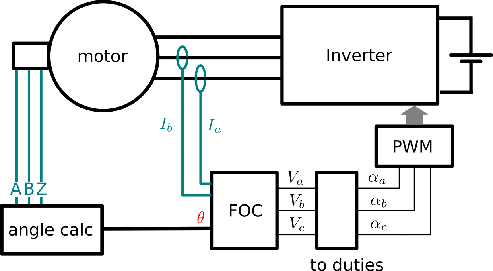
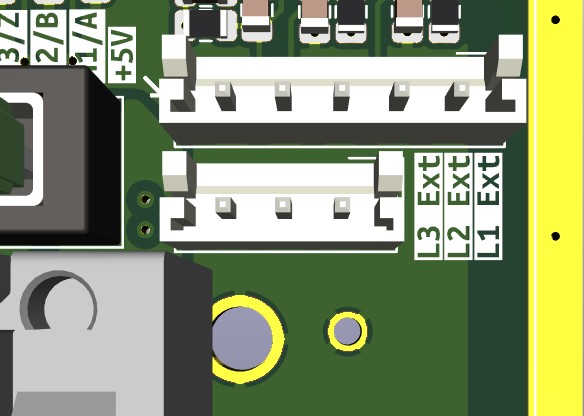

# Field Oriented Control with an optical encoder

## Introduction.

This example show how to regulate the torque in a Permanent Magnet Synchonous Machine
(PMSM) using a Field Oriented Control (FOC) algorithm. 

The FOC is well adapted to PMSM with sine back-emf (electro motive forces) and it generates smooth torque. 
The current regulators (Proportional-Integral) are in the _"dq"_ frame where values
should be constant during steady state operation.

To apply this technique we should have an acquisition of a continuous angle value [0, 2π[.
This algle estimation is done via an optic encoder, which is supported natively by the SPIN board.
We use the value from this encoder to estimate the angle directly. 



## Import libraries to use it.

This example use some software components which are in the owntech `control_library`.
then you must import it by inserting the following line in the `platformio.ini` file.

```ini 
lib_deps=
 control_library = https://github.com/owntech-foundation/control_library.git
 scopemimicry = https://github.com/owntech-foundation/scopemimicry.git
```

## How the _"angle"_ is calculated.

The SPIN board has a dedicated timer (TIMER 3) which is setup to automatically calculate
the angle based on the position of the encoder. From this measurement, it is possible to 
translate the value back in radians throught the following sequence of equations.

First the raw data is normalized.

$ Norm_{angle} = \dfrac{(E_{raw} - E_{offset})}{E_{max}} $

Then this value is translated into radians

$ \theta = \mathrm{mod}_{2\pi} \left( 2\pi \cdot n_p \cdot Norm_{angle}  \right) $

The index value is used to reset the counter automatically. 

In this example, the setup is done by calling the function in line 526.

```cpp
    spin.timer.startLogIncrementalEncoder(TIMER3);
```


## Use this example  

- Wire the motor encoder and the three power phases. 
- The encoder wires are connected to the 5-pin connector shown below: 


!!! info Encoder connection
    This interface is galvanically isolated from the microcontroller.  
    Matching connector is JST EHR 5.  
    Color code of the provided cable is  

    * **+5V** Red  
    * **A** Yellow  
    * **B** Brown  
    * **Z** Green  
    * **GND** Black  


    Max current delivered by the board internal feeder through the +5V/GND is 400mA  
    { width="300"}


- Flash the example to the OwnVerter board.
- In the serial terminal press `p` to start the motor.
- At that point, there is no torque reference as `Iq_ref` is equal to `0`
- Increase the torque reference by pressing `u`. The torque reference is incremented by `0.1A` 
- Increase the torque reference until the motor starts spinning.
- Stop the motor by pressing `i`
- You can retrieve live record by pressing `r`. It will download a data_record containing all declared scope values.
  - By default the recording is triggered by entering `power mode` (by pressing `p`).
  - Alternatively you can press `q` to trigger manually the recording at a different instant, or to reset the trigger
- Plot the values by clicking `Plot recording` in `OwnTech` platformio actions.
- Live data records can also be plotted using OwnPlot by pressing `m`. This way, the recording will be sent as an infinite loop to OwnPlot.

| Control state | Comment |
| ---    | ---        |
| 0      | In this state, the controller is calculating the current offset      |
| 1      | In this state, the controller is idle          |
| 2      | In this state, the controller is in power mode          |
| 3      | In this state, the controller is in error mode. The error mode is entered by repetedely (repedely being defined by `error_counter`) fulfilling the following condition :  `I1_Low` going beyond the bounds `[-AC_CURRENT_LIMIT;+AC_CURRENT_LIMIT]`, `I2_Low` going beyond the bounds `[-AC_CURRENT_LIMIT;+AC_CURRENT_LIMIT]` or `I_High` exceding `DC_CURRENT_LIMIT` |
