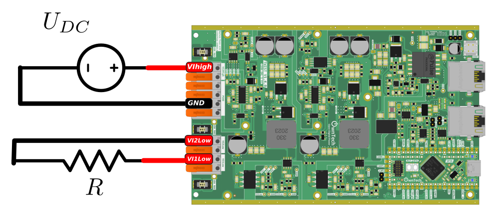

# Ac Voltage Source

In this example we build an AC voltage source using a Twist and supply a resistor.

<div style="text-align:center"></div>

The parameters are:

* $U_{DC} = 40 V$
* $R_{LOAD} = 30 \Omega$.

## Software overview

### Import libraries
This example depends on two libraries:

1. control_library
2. ScopeMimicry

To use them, you have to add the following lines in platformio.ini file:
```
lib_deps=
    control_library = https://github.com/owntech-foundation/control_library.git
    scope = https://github.com/owntech-foundation/scopemimicry.git
```

### Define a regulator

The voltage regulation will be done by a SOGI and clarke-park transform to work on the d-q plane.

Everything is done by the class in the `singlePhaseInverter.h` file.

```cpp
static singlePhaseInverter inverter;
```

The parameters of the class are passed in the `setup_routine`:

```cpp
inverter.init(10.0, w0, Ts);
```

!!! warning How the code works

    This code implements a grid following inverter.
    The inverter will follow a "virtual grid" voltage called `Vnet`.
    You can change `Iq` by pressing `u` for UP and `d` for down.
    The idea is that **the inverter will create a current on the resistance that is phase shifted in relation to `Vnet`.**
    Of course, the current in the resistance is in phase with the output voltage of the inverter.


### To view some variables.

!!!tip Acquisiton

    It is posible to trigger a scope acquisition by :

    1. pressing the `t` button on your keyboard. It takes a few miliseconds.
    2. Once the acquisition is done go in `idle` mode
    3. In `idle mode` and press the `r` button to retrieve the data.
    4. You will automatically see a `Data_records` folder appear with a `.csv`, `.txt` and `.png` file

If you go to the `alien icon`, under the `USB/OwnTech` folder qnd press the `Plot recording` action you will trigger a plot action.

The action will prompt you to choose which record to plot on the terminal. On the example below I choose the pot record 3.

```terminal
record n°01, name 2024-07-10_17-09-22-record.txt
record n°02, name 2024-07-10_17-17-41-record.txt
record n°03, name 2024-07-10_17-19-52-record.txt
Enter record number to plot
3
The record number is: 03

```


## Link between voltage reference and duty cycles.
The voltage source is defined by the voltage difference: $U_{12} = V_{1low} - V_{2low}$.

Link with the duty cycle:

* The leg1 is fixed in buck mode then: $V_{1low} = \alpha_1 . U_{DC}$
* The leg2 is fixed in boost mode then: $V_{2low} = (1-\alpha_2) . U_{DC}$

We change at the same time $\alpha_1$ and $\alpha_2$, then we have : $\alpha_1 = \alpha_2 = \alpha$. <br>
And then: $U_{12} = (2.\alpha - 1).U_{DC}$

$\alpha = \dfrac{U_{12}}{2.U_{DC}}  + 0.5$
